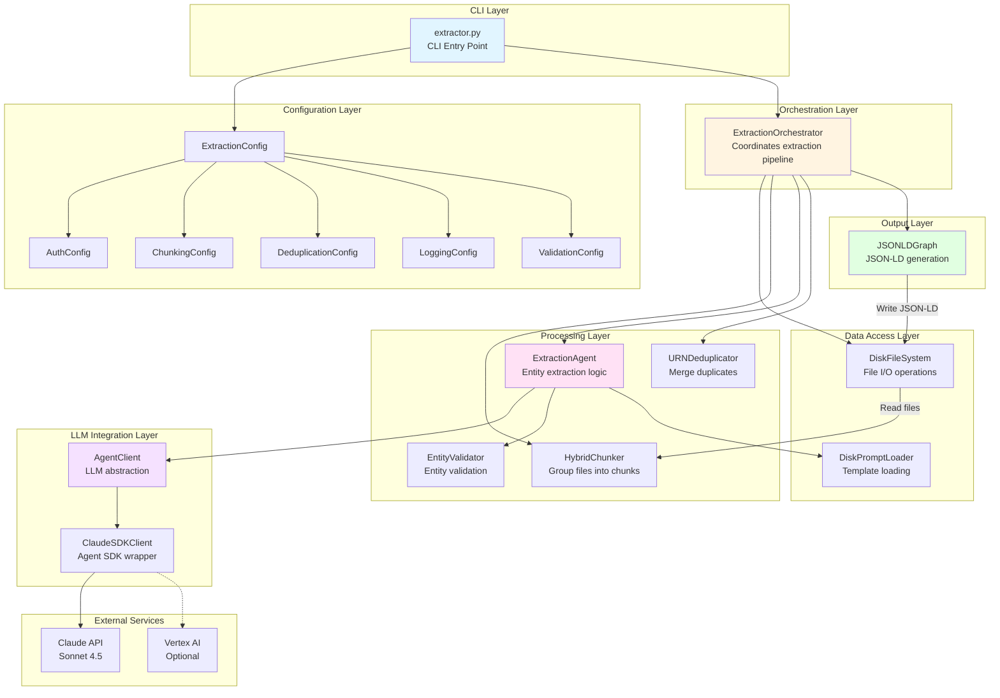
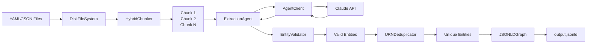
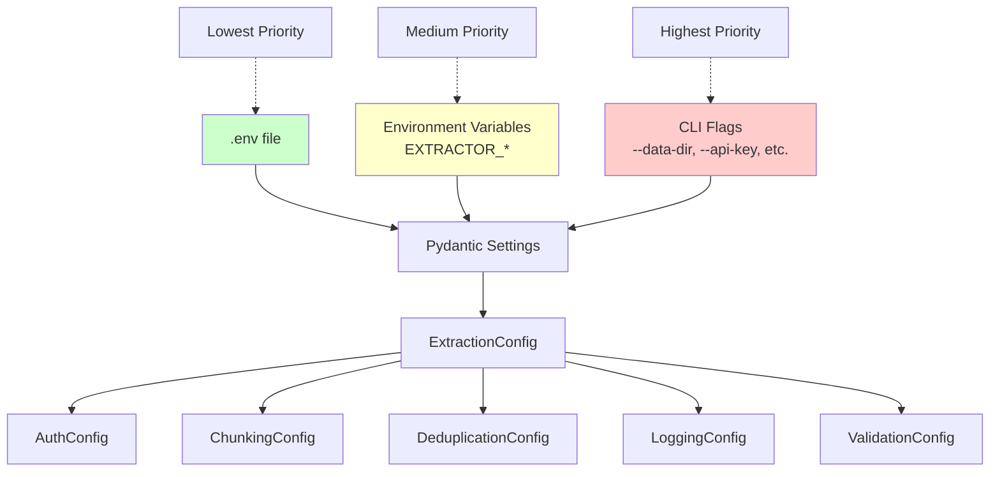

# Component Architecture

This document describes the component architecture of the knowledge graph extraction system.

## High-Level Architecture



## Component Responsibilities

### CLI Layer

#### `extractor.py`

- **Purpose**: Command-line interface and application entry point
- **Responsibilities**:
  - Parse CLI arguments
  - Build configuration from multiple sources (flags, env vars, .env)
  - Initialize all components
  - Execute orchestrator
  - Handle logging setup
  - Report results
- **Key Methods**:
  - `parse_args()` - Argument parsing
  - `build_config_from_args()` - Multi-source config building
  - `setup_logging()` - Logger configuration
  - `main()` - Async entry point

### Configuration Layer

#### `ExtractionConfig`

- **Purpose**: Central configuration management using Pydantic Settings
- **Features**:
  - Environment variable support (`EXTRACTOR_*`)
  - .env file loading (automatic from current directory)
  - CLI flag overrides
  - Nested configuration models
  - Type validation
- **Priority**: CLI Flags > Env Vars > .env > Defaults

### Orchestration Layer

#### `ExtractionOrchestrator`

- **Purpose**: High-level pipeline coordination
- **Workflow**:
  1. Load files from filesystem
  2. Create chunks using chunker
  3. For each chunk:
     - Extract entities via agent
     - Validate entities
     - Collect results
  4. Deduplicate all entities
  5. Return consolidated results
- **Metrics Tracking**:
  - Total/processed chunks
  - Entity counts
  - Validation errors
  - Duration

### Data Access Layer

#### `DiskFileSystem`

- **Purpose**: Abstract file system operations
- **Operations**:
  - Load files from directory
  - Filter by extensions
  - Read file contents
  - Write output files

#### `DiskPromptLoader`

- **Purpose**: Load and render prompt templates
- **Features**:
  - Jinja2 template rendering
  - Template caching
  - Variable substitution

### Processing Layer

#### `HybridChunker`

- **Purpose**: Intelligent file grouping
- **Strategy**:
  - Primary: Group by directory structure
  - Secondary: Split large directories by size
  - Fallback: Size-based splitting
- **Configuration**:
  - `target_size_mb`: Target chunk size (default: 10MB)
  - `max_files_per_chunk`: Max files per chunk (default: 100)

#### `ExtractionAgent`

- **Purpose**: Orchestrate entity extraction for a chunk
- **Process**:
  1. Build extraction prompt with tool usage guidance
  2. Call LLM client with file paths and schema hints
  3. Parse JSON response from agent
  4. Convert to Entity objects
  5. Validate each entity
  6. Return valid entities
- **Error Handling**: Logs validation errors, filters invalid entities

#### `EntityValidator`

- **Purpose**: Validate entity structure and content
- **Checks**:
  - URN format: `urn:type:identifier`
  - Type validity: Alphanumeric, starts with capital letter
  - Required fields: @id, @type, name
  - No Relationship entities (must use predicates)
- **Output**: ValidationResult with errors list

#### `URNDeduplicator`

- **Purpose**: Merge duplicate entities by URN
- **Strategies**:
  - `first`: Keep first occurrence
  - `last`: Keep last occurrence
  - `merge_predicates`: Combine all predicates (default)
- **Output**: DeduplicationResult with merged entities

### LLM Integration Layer

#### `AgentClient`

- **Purpose**: Abstract LLM interaction using Claude Agent SDK
- **Features**:
  - Tool-based extraction (Read, Grep, Glob)
  - Multi-step reasoning
  - Retry logic with exponential backoff
  - JSON response parsing
- **Key Methods**:
  - `extract_entities()` - Tool-based entity extraction
  - `generate()` - Simple text completion
  - `_send_and_receive()` - SDK communication helper
- **Configuration**:
  - Model: claude-sonnet-4-5@20250929
  - Tools: Read, Grep, Glob
  - Permission mode: acceptEdits (auto-approve tools)
  - Retries: 3 attempts
  - Timeout: 300 seconds

#### `ClaudeSDKClient` (from claude-agent-sdk)

- **Purpose**: Claude Agent SDK wrapper
- **API Pattern**:

  ```python
  await client.connect()
  await client.query(prompt)
  async for message in client.receive_response():
      if isinstance(message, ResultMessage):
          result = message.result
  ```

- **Authentication**:
  - API Key: Via `ANTHROPIC_API_KEY` env var
  - Vertex AI: Via Google Cloud credentials

### Output Layer

#### `JSONLDGraph`

- **Purpose**: Build and export JSON-LD knowledge graph
- **Structure**:

  ```json
  {
    "@context": {
      "@vocab": "http://schema.org/",
      "urn": "@id"
    },
    "@graph": [
      {"@id": "...", "@type": "...", "name": "...", ...}
    ]
  }
  ```

- **Methods**:
  - `add_entity()` - Add single entity
  - `add_entities()` - Add multiple entities
  - `save()` - Write to file
  - `load()` - Read from file
- **Properties**:
  - `entity_count` - Number of entities
  - `types` - Unique entity types

## Data Flow



## Configuration Flow



## Error Handling Strategy

1. **LLM Retries**: Exponential backoff (2^attempt seconds)
2. **Validation Errors**: Log and filter, continue processing
3. **Chunk Failures**: Log error, continue with remaining chunks
4. **Connection Errors**: SDK auto-reconnects
5. **File I/O Errors**: Propagate to orchestrator, fail fast

## Extension Points

### Adding New Chunking Strategies

1. Implement `Chunker` protocol
2. Add to `ChunkingConfig.strategy` choices
3. Update orchestrator to use new strategy

### Adding New LLM Providers

1. Implement `LLMClient` protocol
2. Create new client class
3. Update `AuthConfig` with new auth_method
4. Wire into orchestrator

### Adding New Output Formats

1. Create new output builder class
2. Implement `add_entities()` and `save()` methods
3. Add format selection to config
4. Update CLI to use new format

### Adding New Validation Rules

1. Add rule to `EntityValidator`
2. Update `ValidationConfig` if needed
3. Validation is automatically applied

## Testing Strategy

### Unit Tests

- **Config**: Multi-source loading, priority
- **CLI**: Argument parsing, flag overrides
- **Chunking**: Size limits, directory grouping
- **Validation**: URN format, type validity
- **Deduplication**: Merge strategies
- **Output**: JSON-LD generation, roundtrip

### Integration Tests

- End-to-end extraction
- Mock LLM responses
- File system mocking

### Test Coverage

- Target: >80% coverage
- Focus: Business logic, error paths
- Mock: External dependencies (LLM, filesystem)
