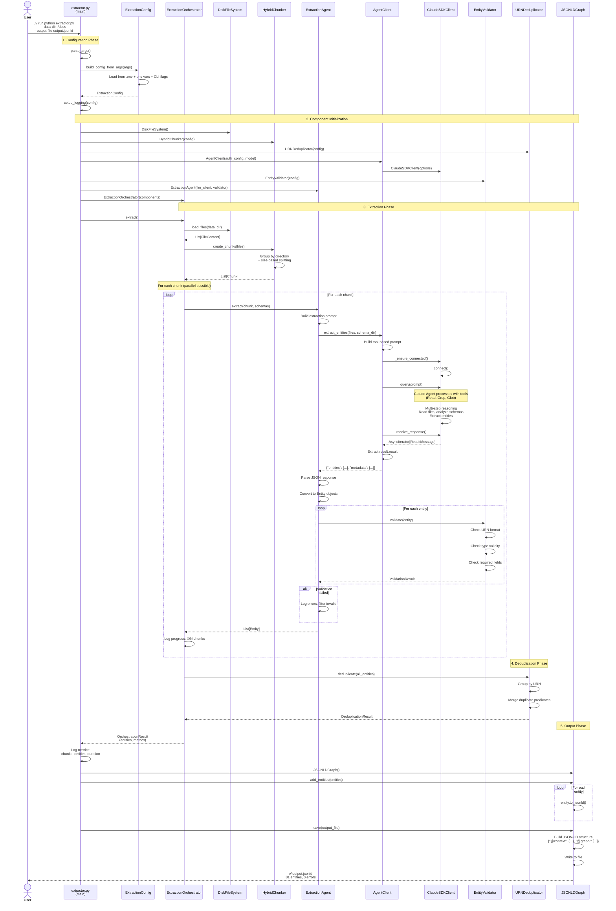

# Knowledge Graph Extraction - Sequence Diagram

This diagram shows the complete flow from CLI invocation to JSON-LD output.



## Key Patterns

### 1. Configuration Priority (Highest to Lowest)

```
CLI Flags > Environment Variables > .env File > Defaults
```

### 2. Chunk Processing

- Files grouped by directory structure
- Size-based splitting when directories exceed limits
- Configurable: `chunk_size_mb`, `max_files_per_chunk`

### 3. Agent-Based Extraction

- Claude Agent SDK with tools (Read, Grep, Glob)
- Multi-step reasoning and file access
- Prompt instructs agent to discover entities through analysis

### 4. Validation Points

- **During Extraction**: EntityValidator checks each entity
- **URN Format**: `urn:type:identifier`
- **Type Validity**: Alphanumeric, starts with capital
- **Required Fields**: @id, @type, name
- **No Relationship Entities**: Must use predicates

### 5. Deduplication Strategy

- **URN-based**: Group entities by URN
- **Merge Strategy**: `merge_predicates` (default)
  - Combines all predicates from duplicates
  - Preserves all relationships

## Metrics Tracked

```python
ExtractionMetrics:
  - total_chunks: int
  - chunks_processed: int
  - entities_extracted: int
  - validation_errors: int
  - duration_seconds: float
```

## Error Handling

1. **Retry Logic**: LLM calls retry up to 3 times with exponential backoff
2. **Validation Errors**: Logged but don't stop extraction
3. **Chunk Failures**: Continue with remaining chunks
4. **Connection Issues**: SDK auto-reconnects

## Performance

- **Parallel Chunks**: Configurable (future enhancement)
- **Streaming**: SDK uses async streaming for responses
- **Checkpointing**: Support for `--resume` flag
- **Example**: 81 entities from 3 chunks in 158.65s (~53s per chunk)
